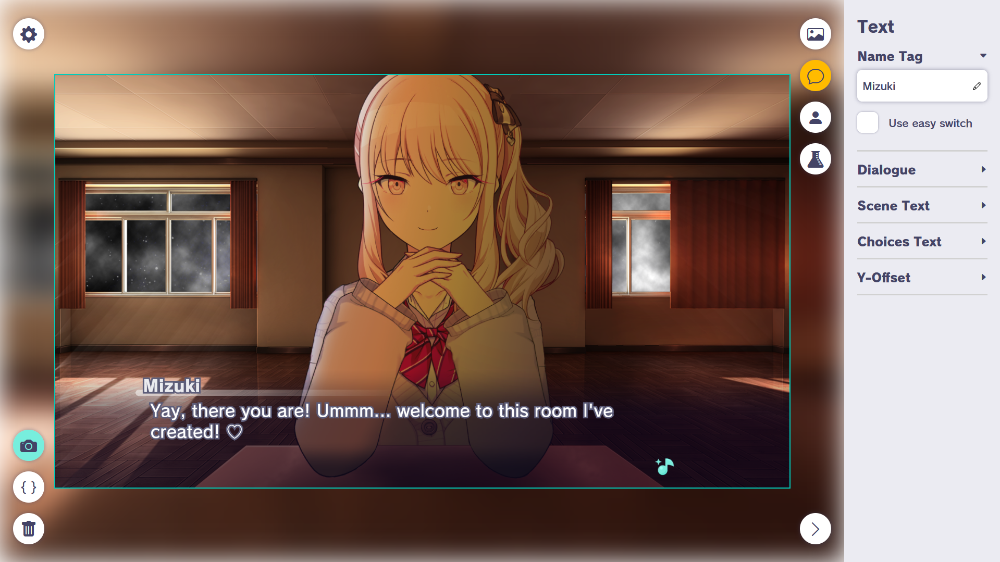
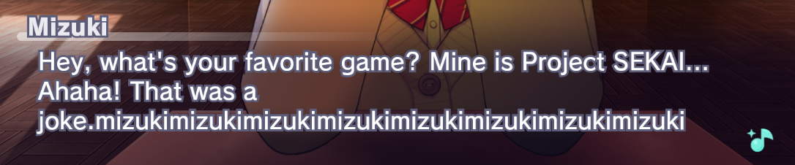
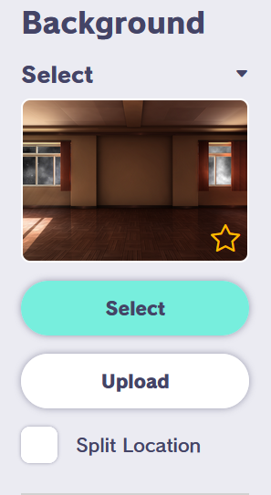
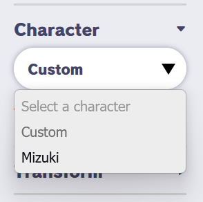

# Mizuki Stories

A Dialogue Generator for making fan-made Mizuki stories from the game [Project SEKAI COLORFUL STAGE!](https://colorfulstage.com/) (also known as Akiyama Mizuki: COLORFUL STAGE!).



## Try the Story Generator!
[](https://april-fools.sekai-stories.pages.dev/) 

## Special Thanks
### SEKAI Viewer
I would like to thank the developers of [Sekai Viewer](https://github.com/Sekai-World/sekai-viewer/) for allowing me to connect their server through this application!

[](https://sekai.best)

### The Localization Contributors
A huge thanks to our translators!

[](https://www.youtube.com/@GatoMagoMusic)
[](https://github.com/MiddleRed)
[](https://github.com/SteveLF-bili)
[](https://github.com/emptylight370)
[](https://github.com/fab144)
[](https://github.com/counter185)
[](https://github.com/aungpaos)
[](https://github.com/39Choko)
[](https://github.com/lmaodick1239)
[](https://github.com/KrajeQQ)

If you wish to contribute for your own language, you can check this [localization guide](./README-localization.md) to help you get started!

## Features
### Only type Mizuki.
Mizuki will be the only word you can type in this dialogue generator. No one else. Just Mizuki.



### No more backgrounds.
It's only us together in this room. Nowhere else.



### Mizuki Models as your sprites.
With no one else around, you can only use Mizuki as your sprites. No one else. Just Mizuki.



## Developing
### Prerequisites
Make sure you have [Node.JS](https://nodejs.org/en) and [npm](https://www.npmjs.com/) in your system. Install them first before proceeding.

### Running the app
Install the required libraries.
```
npm install
```
Once done, you can start the application
```
npm run dev
```

## Report an issue
If you think there's a problem on using the dialogue generator, please don't. I'm afraid the devs would notice it and remove me in the character list.


## Relevant Links
- [Project Sekai Stickers](https://st.ayaka.one/) by [TheOriginalAyaka](https://github.com/TheOriginalAyaka/sekai-stickers)
- [SEKAI Viewer](https://sekai.best/) by [Sekai-World](https://github.com/Sekai-World/sekai-viewer)
- [SIFAS Dialogue Sandbox](https://sifas-dialogue-sandbox.vercel.app/) by me!

----
mizuki is a programmer

[](https://www.youtube.com/c/SmiliePop)[](https://reddit.com/user/lezzthanthree)
