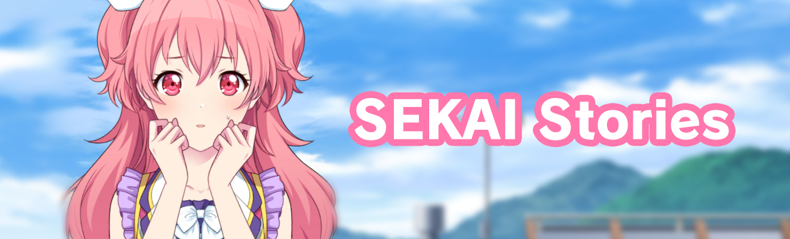

<p align="center">
A Dialogue Generator for making fan-made stories from the game [Project SEKAI COLORFUL STAGE!](https://colorfulstage.com/) (also known as Hatsune Miku: COLORFUL STAGE!).
</p>


## Try the Story Generator!
[](https://sekai-stories.pages.dev/) 

## Special Thanks
### SEKAI Viewer
I would like to thank the developers of [Sekai Viewer](https://github.com/Sekai-World/sekai-viewer/) for allowing me to connect their server through this application!

[](https://sekai.best)

### The Localization Contributors
Huge thanks to our translators!

[](https://www.youtube.com/@GatoMagoMusic)
[](https://github.com/MiddleRed)
[](https://github.com/SteveLF-bili)
[](https://github.com/emptylight370)
[](https://github.com/fab144)
[](https://github.com/counter185)
[](https://github.com/aungpaos)
[](https://github.com/39Choko)
[](https://github.com/lmaodick1239)
[](https://github.com/KrajeQQ)
[](https://github.com/733402)
[](https://github.com/BubblyVaporeon)

If you wish to contribute for your own language, you can check this [localization guide](./README-localization.md) to help you get started!

### The Feature Contributors
Huge thanks to our contributors for helping us add new features to the dialogue generator!

[](https://github.com/00dani)

## Features
### Choose your background
Just like my previous [dialogue sandbox](https://github.com/lezzthanthree/SIFAS-Dialogue-Sandbox), you can choose a background found from Project Sekai!


You can also upload your own background to match your story perfectly.


### Customize the dialogue
Type the dialogues of who's speaking and adjust their font size to match their tone!


### Live2D Models as your sprites!

With their Live2D Models, you can use them as your sprite and choose your perfect poses and emotions to the character of your choosing!


Or, you could upload your own normal PNG Sprite! It's your own choice!


### Make your own poses!

Adjust the parameters of the Live2D models to make your own poses!


## Developing
### Prerequisites
Make sure you have [Node.JS](https://nodejs.org/en) and [npm](https://www.npmjs.com/) in your system. Install them first before proceeding.

### Running the app
Install the required libraries.
```
npm install
```
Once done, you can start the application
```
npm run dev
```

## Report an issue
If you think there's a problem on using the dialogue generator, please [submit a report by opening an issue here](https://github.com/lezzthanthree/SEKAI-Stories/issues).

## Relevant Links
- [Project Sekai Stickers](https://st.ayaka.one/) by [TheOriginalAyaka](https://github.com/TheOriginalAyaka/sekai-stickers)
- [SEKAI Viewer](https://sekai.best/) by [Sekai-World](https://github.com/Sekai-World/sekai-viewer)
- [sssekai](https://github.com/mos9527/sssekai/) by [mos9527](https://github.com/mos9527)
- [SIFAS Dialogue Sandbox](https://sifas-dialogue-sandbox.vercel.app/) by me!

## License
This project is licensed under the GNU General Public License v3.0.

All assets used in this project are property of SEGA, Colorful Palette, and Crypton. This project is not affiliated with said companies in any way.

----

mizuki is a programmer

[](https://www.youtube.com/c/SmiliePop)[](https://reddit.com/user/lezzthanthree)
